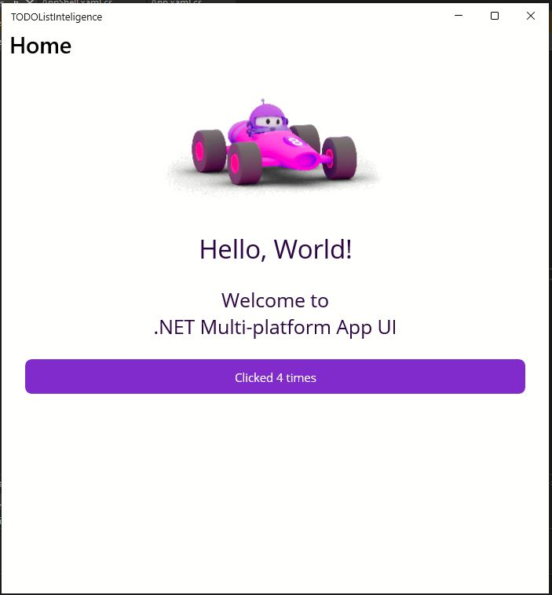

# Registro de configuracion del proyecto .NET MAUI

## Fecha
**12/4/2025**

## Creacion del proyecto
- **Framework utilizado:** .NET 8
- Instalacion de `maui-check` con el comando:
  **`dotnet tool install -g redth.net.maui.check`**
- Ejecuci�n del comando **`maui-check`** para verificar si el proyecto contiene todos los componentes necesarios o si hay alguno desactualizado.

## Problemas encontrados
- Faltaban componentes en **Android SDK**, por lo que proced� a la instalaci�n de los siguientes desde la herramienta **`maui-check`**, aunque estaba dando problemas y no instalaba correctamente.

## Configuracion manual
### Variables de entorno configuradas:
- **Ruta principal del SDK:**
	**`C:\Users\mcris\AppData\Local\Android\Sdk`** 
- **Rutas a�adidas al `PATH`:**			
  **`%ANDROID_SDK_ROOT%\platform-tools`** 
  **`%ANDROID_SDK_ROOT%\emulator`** 
  **`%ANDROID_SDK_ROOT%\cmdline-tools\latest\bin`** 

  
### Configuracion desde Visual Studio:
1. **Emulator (31.3.12):** Simula un dispositivo Android.
2. **Build-tools (33.0.0):** Incluye compiladores y herramientas de empaquetado.
3. **System-images (android-33;google_apis;x86_64):** Im�genes del sistema Android que permiten emular diferentes versiones.
4. **Cmdline-tools (8.0):** Herramientas de l�nea de comandos.

## Verificacion final
- Ejecut� el emulador para corroborar que pod�a interactuar con �l.

## Fecha
**13 y 14/4/2025**

### Integración de Grial UI Kit y avances en la estructura del proyecto ###
- Estuve leyendo documentación y recursos sobre la estructura de proyectos en .NET MAUI y las mejores prácticas para organizar la solución.

- Inicié la integración de Grial UI Kit para .NET MAUI, siguiendo el procedimiento oficial para enlazarlo y vincularlo correctamente al proyecto.

- Tuve numerosos problemas de instalación y de licencia con Grial; tras varios intentos y revisiones, logré vincular la biblioteca y agregar las plantillas al proyecto.

- Añadí la extensión de Grial a Visual Studio y creé una cuenta en Grial para gestionar la licencia y acceder a los recursos.

- Configuración de Grial en Visual Studio:

    - Accedí a Herramientas > Opciones > Administrador de paquetes NuGet > Orígenes de paquetes.

    - Añadí la URL del repositorio privado de Grial como nuevo origen de paquetes NuGet para poder instalar y restaurar los paquetes de Grial en el proyecto.

    - Guardé los cambios y verifiqué que Visual Studio reconociera el nuevo origen.

- Me familiaricé con la biblioteca de Grial

- Renombré archivos existentes para adaptarlos a la estructura y convenciones de Grial, asegurando la compatibilidad con las nuevas plantillas.

- Incorporé varias plantillas de Grial a la solución tratando de  personalizar y adaptar la estructura generada a las necesidades del proyecto.

- Diseñé parte de la interfaz de usuario, incluyendo pantallas de login, registro, configuración de tema e idioma, y el cuestionario inicial.

**Importante** : Todavía no he subido el código con las plantillas de Grial al repositorio porque actualmente está desorganizado y necesita una reestructuración. Además, requiero un entendimiento más profundo de cómo funciona Grial para organizar correctamente la arquitectura y los recursos antes de compartir el código.

### Notas adicionales: ###

- Grial UI Kit proporciona una amplia colección de plantillas XAML y recursos de UI para acelerar el desarrollo de aplicaciones .NET MAUI, permitiendo personalizar temas, idiomas y componentes visuales de forma sencilla.

- La integración de Grial facilita la separación entre lógica de negocio y presentación, siguiendo el patrón MVVM y mejorando la mantenibilidad del proyecto.

**Estado actual:**
- El proyecto no tiene las plantillas de Grial bien integradas y necesita una reestructuración, ya que actualmente no funcionan correctamente.

- Es necesario aprender más sobre la biblioteca Grial para poder realizar la configuración adecuada y entender cómo relacionar las vistas y el código XAML.

- Quedan paquetes por instalar y resolver problemas de dependencias que impiden el funcionamiento correcto del proyecto.

**Próximos pasos**
- Reestructurar el código y organizar correctamente la solución.

- Profundizar en el aprendizaje de la estructura y funcionamiento de Grial UI Kit.

- Comprender cómo se relacionan las vistas y cómo trabajar con el código XAML generado por Grial.

- Instalar y verificar correctamente todos los paquetes y dependencias necesarias.

- Una vez que todo esté funcionando y bien organizado, subir el código al repositorio.
